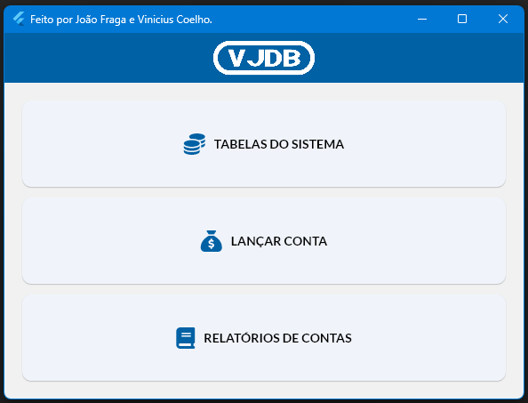

# 

Projeto final da disciplina de Banco de Dados I.
 👨‍🎓: João Fraga e Vinicius Coelho
 👨‍🏫: Maurício Pasetto de Freitas
 📅: 29/11/2024

## 📝 Sobre a Aplicação

O projeto *VJDB* consiste em um sistema modular focado na gestão de contas a receber, oferecendo funcionalidades essenciais para o controle e organização de lançamentos financeiros. A aplicação foi desenvolvida com o objetivo de ser intuitiva, eficiente e prática, atendendo às necessidades de usuários que desejam uma solução simples e funcional para gerenciar suas contas.

## 💿 Diferenciais do Sistema

- Simplicidade: Interface objetiva, ideal para usuários com foco em produtividade.
- Funcionalidade Completa: Abrange todos os recursos necessários para o controle eficiente das contas lançadas.
- Aplicação Didática: Projeto desenvolvido com base nos princípios aprendidos na disciplina, aplicando técnicas de modelagem, consultas SQL e boas práticas de desenvolvimento.

   

  
Tela inicial do sistema:

## 🛠️ Tecnologias Utilizadas

- Flutter: Framework para desenvolvimento multiplataforma.
- Dart: Linguagem de programação usada no Flutter.
- MySQL: Banco de dados relacional utilizado para armazenar as informações.
